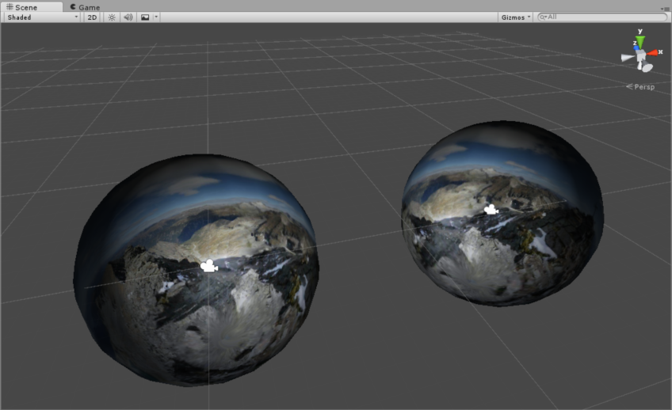
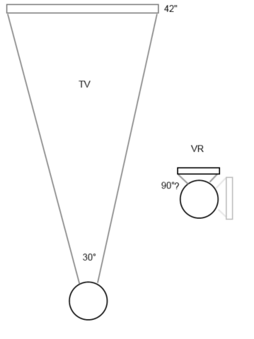
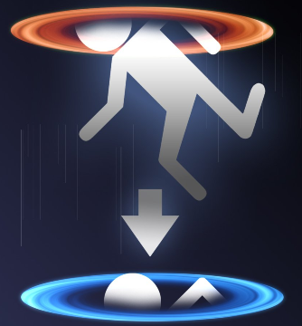
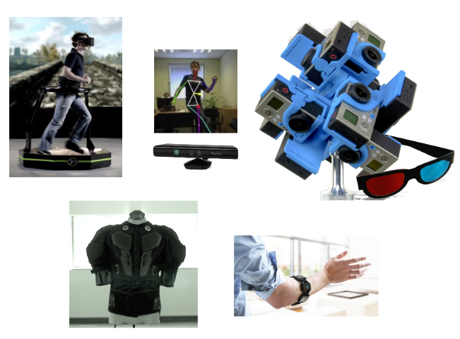
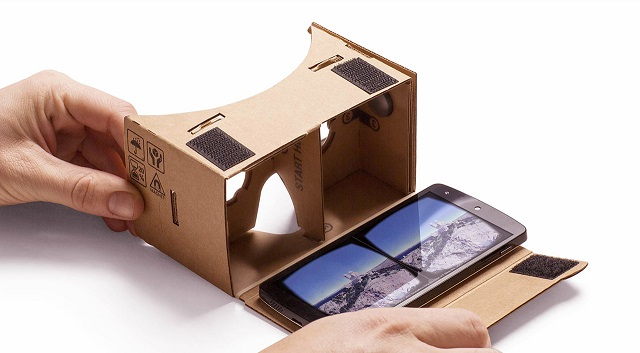
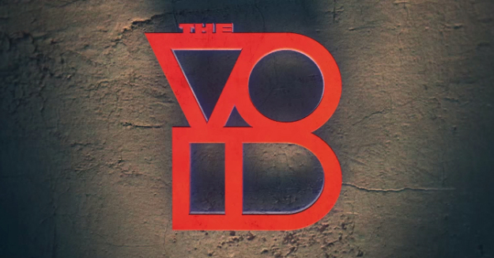

# A dive into Virtual Reality

---

# Sphere demo 
<!--- (15 min) --->
<!--- 1. Intro: gaming, kristof, OR group --->
<!--- 2. Volunteer for sphere 1 --->
<!--- 3. Explain the Dive, phone, cardboard --->
<!--- 4. Are you seeing 3D right now? --->
<!--- 5. Sphere demo 2 with 3D --->
<!--- 6. Unity 3D --->

---

# VR and 3D are two different things
<!--- (5 min) --->
<!--- 1. Viewing angle and tracking --->
<!--- 2. Pixels and latency --->

---

# Demo 2: Portal

<!--- (15 min) --->
<!--- 1. Volunteer --->
<!--- 2. Scala app for Android --->
<!--- 3. Splashtop for viewing --->
<!--- 4. Tridef 3D for SBS --->

---

# Periphery and things to come

<!--- (5 min) --->

---
# So is VR just for gamers? 

<!--- (15 min) --->

1. Gaming
2. Animated movies
3. Remote viewing & operation (repairing Hubble?)
4. 3D design
5. Training with minimal risk and cost
6. Therapy

---

# Cardboard Quiz! 

<!--- (5 min) --->
<!--- The cheapest VR can get --->
<!--- Post-its --->
<!--- Facebook --->
<!--- Cave --->
<!--- 1987, closest N win --->

1. Which company acquired the Oculus Rift last year?
2. What do you call a room which uses projectors on walls for VR?
3. When was the term Virtual Reality popularized? 

---

## Questions?

[https://github.com/Oduig/dive](https://github.com/Oduig/dive)

*Presentation powered by Landslide*
